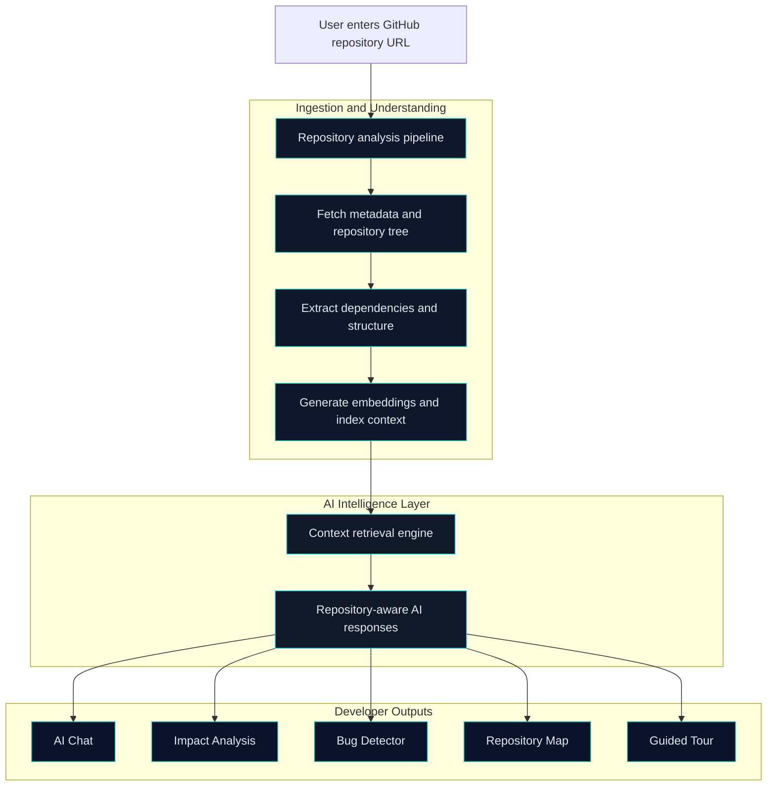

<p align="center">
	
</p>

<p align="center">
	
</p>

<p align="center">
	
	
	
	
	
</p>

---

## Why This Project

AI Codebase Navigator turns any GitHub repository into an interactive developer cockpit.

Instead of manually reading file-by-file, it helps you:

- Understand architecture quickly
- Explore structure visually
- Detect dependencies and risk zones
- Ask codebase-specific questions with AI
- Simulate change impact before editing

> Built to solve: "How can developers safely understand and modify unfamiliar codebases faster?"

---

## Feature Highlights

| Feature | What it does |
|---|---|
| Analyze Repository | Ingests a GitHub URL and builds repository insights |
| Repository Map | Visualizes folder and module hierarchy |
| Dependency Explorer | Detects packages and versions quickly |
| AI Chat | Answers context-aware questions about analyzed code |
| Impact Analysis | Predicts blast radius for file/module/function changes |
| Bug Detector | Surfaces risky code paths and bug hotspots |
| Guided Codebase Tour | Walks through key modules for faster onboarding |

---

## Animated Flow



---

## Tech Stack

<p align="center">
	
</p>

<p align="center">
	
	
	
</p>

<table>
	<tr>
		<th align="left" width="22%">Domain</th>
		<th align="left">Stack</th>
		<th align="left" width="22%">Purpose</th>
	</tr>
	<tr>
		<td><strong>Frontend UI</strong></td>
		<td>
			
			
			
			
			
			
		</td>
		<td>Interactive, responsive, animated UX</td>
	</tr>
	<tr>
		<td><strong>Backend API</strong></td>
		<td>
			
			
			
			
		</td>
		<td>Auth, analysis, routing, and API orchestration</td>
	</tr>
	<tr>
		<td><strong>Data Layer</strong></td>
		<td>
			
			
			
		</td>
		<td>Persistence, caching, and fast retrieval</td>
	</tr>
	<tr>
		<td><strong>AI + Search</strong></td>
		<td>
			
			
			
		</td>
		<td>Context indexing, semantic retrieval, code-aware AI</td>
	</tr>
	<tr>
		<td><strong>Payments + Deploy</strong></td>
		<td>
			
			
			
		</td>
		<td>Subscription checkout and production hosting</td>
	</tr>
</table>

---

## Project Structure

```text
ai-code-nav/
|- backend/   # APIs, auth, repository analysis, AI services
|- client/    # UI pages, components, interactions
|- README.md
```

---

## Quick Start

### 1. Clone

```bash
git clone <YOUR_REPO_URL>
cd "ai code nav"
```

### 2. Backend

```bash
cd backend
npm install
npm run dev
```

### 3. Frontend

```bash
cd client
npm install
npm run dev
```

---

## Environment Variables

### Backend (.env)
- Database/cache: Supabase, Redis
- Auth/session: JWT secret, cookie secret
- OAuth: GitHub, Google
- AI providers: OpenRouter, embeddings
- Payment (optional): Stripe

### Frontend (.env)
- `VITE_API_URL`
- `VITE_GOOGLE_CLIENT_ID`

---

## Demo Sequence

1. Login with GitHub or Google
2. Analyze a repository URL
3. Show Repository Map
4. Ask AI Chat a repo-specific question
5. Run Impact Analysis on a target module
6. Show Bug Detector + dependencies + guided tour

---

## Created By

<table>
	<tr>
		<td align="center" width="50%">
			<a href="https://github.com/ParthPipermintwala">
				
			</a>
			<br />
			<strong>ParthPipermintwala Pipermintwala</strong>
			<br />
			<sub>Full-Stack + Product Engineering</sub>
			<br /><br />
			<a href="https://github.com/ParthPipermintwala">
				
			</a>
		</td>
		<td align="center" width="50%">
			<a href="https://github.com/DarshanModi07">
				
			</a>
			<br />
			<strong>Darshan Modi</strong>
			<br />
			<sub>AI Logic + Developer Experience</sub>
			<br /><br />
			<a href="https://github.com/DarshanModi07">
				
			</a>
		</td>
	</tr>
</table>

<p align="center">
	Made with code, coffee, and hackathon pressure.
</p>

<p align="center">
	
	
</p>

<p align="center">
	
</p>


